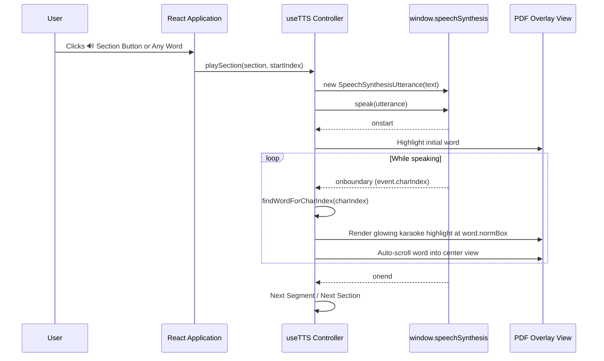

# Technical Architecture & Developer Documentation: PDF Voice Reader

Welcome to the comprehensive technical documentation for **PDF Voice Reader (পিডিএফ ভয়েস রিডার)**. This document covers the internal architecture, mathematical coordinate mappings, speech synthesis boundary synchronization, multi-lingual language routing, and API specifications.

---

## Table of Contents
1. [System Overview](#1-system-overview)
2. [Coordinate Normalization & Word Extraction Pipeline](#2-coordinate-normalization--word-extraction-pipeline)
3. [Real-Time Speech Synchronization Engine](#3-real-time-speech-synchronization-engine)
4. [Bilingual (Bangla & English) Auto-Switching System](#4-bilingual-bangla--english-auto-switching-system)
5. [Text-to-Speech Custom Document Mode](#5-text-to-speech-custom-document-mode)
6. [Component Hierarchy & Data Flow](#6-component-hierarchy--data-flow)
7. [Service & Hook API Reference](#7-service--hook-api-reference)
8. [Performance & Browser Optimization](#8-performance--browser-optimization)
9. [Troubleshooting & Edge Cases](#9-troubleshooting--edge-cases)

---

## 1. System Overview

PDF Voice Reader is a 100% client-side web application built with **React 18**, **Vite 6**, **PDF.js**, and the browser **Web Speech API**. It operates without any backend servers or paid third-party APIs.

### Core Architectural Objectives
- **Zero Latency Audio-Visual Sync**: Millisecond-accurate mapping between vocalized audio words and visual bounding boxes on PDF canvases.
- **Bilingual & Mixed-Language Support**: Seamless transitions between English and Bengali (বাংলা) voices within the same paragraph or document.
- **Privacy & Portability**: Completely static client-side processing — document bytes and text never leave the user's browser.
- **Universal Responsiveness**: Adaptive UI that functions smoothly across smartphones, tablets, laptops, and wide desktop displays.

---

## 2. Coordinate Normalization & Word Extraction Pipeline

PDF document coordinate systems originate from the **bottom-left corner** $(0,0)$, whereas HTML Canvas and CSS viewports originate from the **top-left corner**.

```
PDF Coordinates:                   Viewport Coordinates:
(0, pageHeight) ┌──────────────┐   (0, 0) ┌──────────────┐
                │              │          │              │
                │  PDF Page    │   --->   │  HTML Canvas │
                │              │          │              │
         (0, 0) └──────────────┘          └──────────────┘ (pageWidth, pageHeight)
```

### 2.1 Transformation Matrix to Normalized Coordinates
When calling `page.getTextContent({ includeMarkedContent: true })`, PDF.js yields text items with a 6-element transformation matrix:

$$\mathbf{T} = [s_x, \text{skew}_y, \text{skew}_x, s_y, t_x, t_y]$$

Where:
- $t_x$: Horizontal origin in PDF points
- $t_y$: Vertical baseline origin in PDF points
- $s_y$: Font scale / height

To obtain **normalized coordinates** $(x, y, w, h) \in [0.0, 1.0]$:

$$\text{normX} = \frac{t_x}{\text{pageWidth}}$$

$$\text{normY} = \frac{\text{pageHeight} - t_y - \text{itemHeight}}{\text{pageHeight}}$$

$$\text{normW} = \frac{\text{itemWidth}}{\text{pageWidth}}$$

$$\text{normH} = \frac{\text{itemHeight}}{\text{pageHeight}}$$

### 2.2 Proportional Sub-Word Tokenization
Because a single PDF text item can contain multiple space-separated words (e.g. `"The quick brown fox"`), sub-word bounding boxes are computed proportionally:

$$\text{wordNormX} = \text{normX} + \left(\frac{\text{charStartIndex}}{\text{itemStringLength}}\right) \times \text{normW}$$

$$\text{wordNormW} = \left(\frac{\text{wordLength}}{\text{itemStringLength}}\right) \times \text{normW}$$

### 2.3 Visual Line & Paragraph Clustering
1. **Vertical Sorting**: Text items are sorted from top to bottom by $\text{normY}$.
2. **Line Grouping**: Items whose vertical delta $|\text{normY}_a - \text{normY}_b| < 0.45 \times \text{avgHeight}$ are merged into a horizontal line and sorted left to right.
3. **Paragraph Detection**: Consecutive lines with a vertical gap $\Delta y > 0.85 \times \text{lineHeight}$ trigger a new logical section/paragraph.

---

## 3. Real-Time Speech Synchronization Engine

Speech synthesis and word tracking are managed by the custom [`useTTS`](file:///d:/WIN/DOCUMENTS/GitHub/Dory-Main-Website/PDF%20READER/src/hooks/useTTS.js) React hook.



### 3.1 `onboundary` Event Resolution
When the browser fires `utterance.onboundary`:
- `event.charIndex` provides the start character offset within `utterance.text`.
- The matching word is located via range checking:

$$\text{word.charStart} \le \text{charIndex} < \text{word.charEnd}$$

If the offset falls on a boundary space or punctuation, the algorithm falls back to the word with minimal Euclidean character distance $|\text{word.charStart} - \text{charIndex}|$.

### 3.2 Chrome Garbage Collection Keep-Alive
Chromium has a known quirk where long utterances (> 15 seconds) can pause unexpectedly due to internal garbage collection. `useTTS` prevents this with:
1. **Paragraph Chunking**: Dividing documents into comfortable ~30–80 word segments.
2. **Heartbeat Timer**: A non-disruptive 12-second pulse that calls `speechSynthesis.pause()` and `speechSynthesis.resume()`.

---

## 4. Bilingual (Bangla & English) Auto-Switching System

The application features an intelligent Unicode classifier in [`languageService.js`](file:///d:/WIN/DOCUMENTS/GitHub/Dory-Main-Website/PDF%20READER/src/services/languageService.js).

### 4.1 Unicode Code Point Classification
- **Bengali Characters**: Unicode Block `\u0980` through `\u09FF`
- **Latin/English Characters**: `[a-zA-Z]`
- **Neutral**: Numbers, punctuation, math symbols, whitespace

### 4.2 Segment Queue Execution
When reading a section with mixed text (e.g. *"AI এখন জীবনের অংশ। This is powerful."*):
1. **Segmentation**: The paragraph is split into sequential language chunks:
   - Segment 1: `"AI এখন জীবনের অংশ।"` $\rightarrow$ `lang: 'bn-BD'`
   - Segment 2: `"This is powerful."` $\rightarrow$ `lang: 'en-US'`
2. **Sequential Dispatch**:
   - Segment 1 is synthesized using the preferred **Bangla Voice** (`bn-BD` / `bn-IN`).
   - On completion (`onend`), Segment 2 is automatically synthesized using the preferred **English Voice** (`en-US`).
   - Character offsets and word highlights remain completely continuous throughout both segments!

---

## 5. Text-to-Speech Custom Document Mode

In addition to PDFs, users can copy-paste text or upload `.txt` / `.md` files:
1. [`textParserService.js`](file:///d:/WIN/DOCUMENTS/GitHub/Dory-Main-Website/PDF%20READER/src/services/textParserService.js) tokenizes raw text into structured paragraph cards.
2. [`TextViewer.jsx`](file:///d:/WIN/DOCUMENTS/GitHub/Dory-Main-Website/PDF%20READER/src/components/TextViewer.jsx) renders the text in a clean, typography-focused reading interface.
3. Every word is rendered as an interactive element (`<span className="text-word-span">`) supporting click-to-read and the same glowing karaoke highlighting.

---

## 6. Component Hierarchy & Data Flow

```
<App>
  ├── <Header>                     # Brand, file upload, sample picker, zoom, dark/light theme
  │     └── <DropdownMenu>         # Sample PDFs dropdown
  │
  ├── <main.app-main-content>
  │     ├── [No Doc]  -> <UploadZone>       # Drag-and-drop zone + Paste Text card
  │     ├── [PDF Doc] -> <PdfViewer>        # Multi-page canvas + karaoke highlight overlay
  │     │                  └── <PdfPage>    # Canvas rendering + section 🔊 play buttons
  │     └── [Text Doc]-> <TextViewer>       # Formatted paragraph cards + word highlights
  │
  ├── <PlaybackDock>               # Floating controller with animated audio visualizer
  ├── <PasteTextModal>             # Custom text paste & type modal
  └── <VoiceSettingsModal>         # Dual voice pickers (Bangla/English), speed, pitch & themes
```

---

## 7. Service & Hook API Reference

### `pdfService.js`
- `loadPdfDocument(source: File | Blob | ArrayBuffer | string): Promise<PDFDocumentProxy>`
  Loads PDF binary into a PDF.js document proxy.
- `extractDocumentStructure(pdfDoc): Promise<DocumentStructure>`
  Extracts multi-page structured sections, lines, and word coordinates.
- `renderPageToCanvas(page, canvas, scale): Promise<RenderResult>`
  Renders page to canvas with high-DPI device pixel ratio.

### `languageService.js`
- `detectLanguage(text: string): 'bn-BD' | 'en-US'`
  Determines primary language based on character code frequencies.
- `segmentSectionByLanguage(section, startWordIndex): Array<SpeechSegment>`
  Splits mixed paragraphs into sequential language chunks.
- `findBestVoiceForLanguage(voices, lang, preferredURI): SpeechSynthesisVoice`
  Resolves the optimal voice object from installed browser voices.

### `textParserService.js`
- `parseRawTextToDocument(rawText: string, title?: string): DocumentStructure`
  Parses raw string into structured sections and tokenized words.

### `useTTS.js`
- `playSection(section, startWordIndex?: number): void`
- `pause(): void`
- `resume(): void`
- `stop(): void`
- `togglePlayPause(): void`
- `nextSection(): void`
- `prevSection(): void`

---

## 8. Performance & Browser Optimization

| Feature | Implementation | Benefit |
| :--- | :--- | :--- |
| **Worker Offloading** | `pdf.worker.min.js` bundled locally via Vite | Non-blocking background PDF decoding |
| **High-DPI Scaling** | `window.devicePixelRatio` canvas backing store | Crisp text rendering on Retina & 4K displays |
| **Memory Management** | Render task cancellation on zoom change | Eliminates memory leaks during rapid resizing |
| **CSS GPU Acceleration** | `transform: scale(1.04)`, `backdrop-filter: blur(20px)` | 60 FPS smooth animations on mobile and desktop |

---

## 9. Troubleshooting & Edge Cases

### 1. Scanned Image PDFs (No Extractable Text)
If a PDF page contains purely scanned raster images without OCR text layers, `pdfService.js` detects `hasText === false` and displays a non-intrusive warning badge. Text-to-speech is safely bypassed for that page without throwing errors.

### 2. Browser Voice Availability
- **Google Chrome & Edge**: Ships with native multi-lingual speech synthesis.
- **Offline / Minimal Systems**: If no Bengali voice is installed, setting `utterance.lang = 'bn-BD'` routes to the browser's built-in cloud synthesis engine.

---

<div align="center">
  <sub>PDF Voice Reader Architecture Documentation • Version 1.0.0</sub>
</div>
