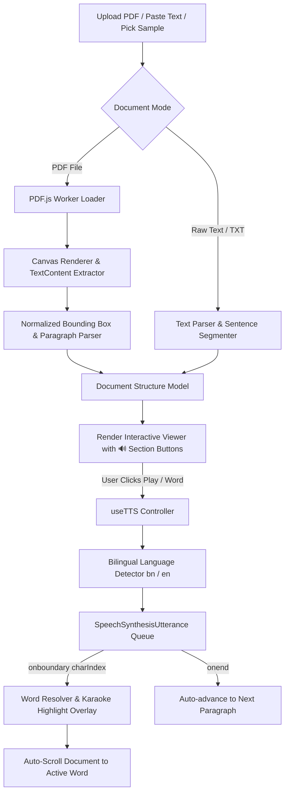

<div align="center">

# 🎙️ PDF Voice Reader (পিডিএফ ভয়েস রিডার)
### *Next-Generation Real-Time Word Highlighting Text-to-Speech Engine*

[](https://reactjs.org/)
[](https://vitejs.dev/)
[](https://mozilla.github.io/pdf.js/)
[](https://developer.mozilla.org/en-US/docs/Web/API/Web_Speech_API)
[](LICENSE)
[]()

<br />

> **Listen to any PDF or custom text document with real-time, word-by-word karaoke highlighting.**  
> Supports **English**, **Bengali (বাংলা)**, and **Mixed-Language Documents** with automatic voice switching.  
> **100% Free • Zero Server Costs • No API Keys Required • 100% Client-Side Privacy.**

<br />

[✨ Features](#-key-features) • [🚀 Quick Start](#-quick-start) • [⚡ 1-Click Windows Launch](#-windows-1-click-launcher) • [🌐 Architecture](#-system-architecture) • [📖 Documentation](#-detailed-documentation) • [🌐 Browser Support](#-browser-compatibility)

---

</div>

<br />

## 🌟 Key Features

<table>
  <tr>
    <td width="50%">
      <h3>📄 Multi-Page PDF Rendering</h3>
      <ul>
        <li>Renders standard and complex PDF documents with high-DPI canvas resolution.</li>
        <li>Dynamic zoom controls: <code>50%</code> to <code>250%</code>, auto-fit width, and pinch-to-zoom.</li>
        <li>Drag-and-drop or file picker upload support.</li>
      </ul>
    </td>
    <td width="50%">
      <h3>🎤 Real-Time Karaoke Word Sync</h3>
      <ul>
        <li>Uses browser <code>onboundary</code> events to match speech with exact bounding boxes.</li>
        <li>Glows word-by-word in real time as the voice speaks.</li>
        <li><b>Click-to-Read:</b> Click <i>any word</i> on the page to immediately start reading from there!</li>
      </ul>
    </td>
  </tr>
  <tr>
    <td width="50%">
      <h3>🇧🇩 Dual-Language Auto-Switch (বাংলা ও English)</h3>
      <ul>
        <li>Intelligent language detection for Bengali (<code>\u0980-\u09FF</code>) and English.</li>
        <li>Automatically switches between Bengali and English voices per sentence/phrase in mixed documents.</li>
        <li>Separate voice pickers for Bangla and English with instant test audio preview.</li>
      </ul>
    </td>
    <td width="50%">
      <h3>✍️ Custom Text-to-Speech Mode</h3>
      <ul>
        <li>Copy and paste any article, notes, or story to read aloud in Kindle/Medium-style view.</li>
        <li>Supports direct upload of <code>.txt</code> and <code>.md</code> files.</li>
        <li>Displays live word counts, character counts, and estimated reading time.</li>
      </ul>
    </td>
  </tr>
  <tr>
    <td width="50%">
      <h3>🎛️ Floating Glassmorphic Playback Dock</h3>
      <ul>
        <li>Play, Pause, Resume, Stop, and Skip to Next/Previous section.</li>
        <li>Live animated equalizer soundwave visualizer.</li>
        <li>Quick speed presets (<code>0.75x</code>, <code>1.0x</code>, <code>1.25x</code>, <code>1.5x</code>, <code>2.0x</code>) & pitch controls.</li>
        <li>Continuous auto-reading mode across document sections.</li>
      </ul>
    </td>
    <td width="50%">
      <h3>📱 100% Fully Responsive Design</h3>
      <ul>
        <li>Tailored layouts for <b>Smartphones (360px–480px)</b>, <b>Tablets (768px–1024px)</b>, and <b>Laptops/Monitors</b>.</li>
        <li>Compact 2-row mobile floating dock with zero button overlap.</li>
        <li>4 Karaoke Highlight Themes: Amber Gold, Electric Cyan, Emerald Mint, Neon Violet.</li>
      </ul>
    </td>
  </tr>
</table>

---

## 🛠️ Tech Stack & Architecture

| Component | Technology | Description |
| :--- | :--- | :--- |
| **Frontend Framework** | **React 18** | High-performance modular reactive UI components |
| **Build & Dev Tool** | **Vite 6** | Instant HMR and optimized production bundling |
| **PDF Rendering Engine** | **PDF.js (`pdfjs-dist`)** | Canvas page rendering & word bounding box geometry extraction |
| **Speech Synthesis** | **Web Speech API** | Client-side `window.speechSynthesis` with `SpeechSynthesisUtterance` |
| **Language Intelligence** | **Custom Engine** | Unicode-based language detector & mixed-language sentence chunker |
| **Icons & Visuals** | **Lucide React** | Modern, clean vector iconography |
| **Effects** | **canvas-confetti** | Celebration feedback upon completing documents |
| **Styling** | **Vanilla CSS + Tokens** | Modern glassmorphism, responsive grid/flexbox, dark & light themes |

---

## 🚀 Quick Start

### Prerequisites
- [Node.js](https://nodejs.org/) (version 18.0 or higher)
- npm (version 9.0 or higher)

### 1. Clone the Repository
```bash
git clone https://github.com/engrshuvodas/PDF-READER.git
cd "PDF READER"
```

### 2. Install Dependencies
```bash
npm install
```

### 3. Start Local Development Server
```bash
npm run dev
```
Open **`http://localhost:3000/`** in your browser (Google Chrome or Microsoft Edge recommended for highest boundary sync precision).

### 4. Build for Production
```bash
npm run build
```
The optimized static bundle will be built into the `dist/` directory, ready to deploy to Vercel, Netlify, or GitHub Pages.

---

## ⚡ Windows 1-Click Launcher

For Windows users, we provide pre-configured launcher scripts:

Simply **double-click** either:
- **`run.bat`** or **`start.bat`**

The launcher automatically:
1. Verifies Node.js installation.
2. Automatically installs dependencies (`npm install`) if missing.
3. Launches the Vite development server.
4. Opens your default web browser directly to `http://localhost:3000/`.

---

## 🌐 System Architecture



---

## 🌐 Browser Compatibility

| Browser | Platform | Highlighting Accuracy | Audio Synthesis | Recommended |
| :--- | :--- | :---: | :---: | :---: |
| **Google Chrome** | Windows / macOS / Linux / Android | ⭐⭐⭐⭐⭐ Ideal | 100% Support | ✅ **Highly Recommended** |
| **Microsoft Edge** | Windows / macOS / Linux | ⭐⭐⭐⭐⭐ Ideal | 100% Support | ✅ **Highly Recommended** |
| **Brave / Chromium** | All Platforms | ⭐⭐⭐⭐⭐ Ideal | 100% Support | ✅ **Recommended** |
| **Apple Safari** | iOS / iPadOS / macOS | ⭐⭐⭐ Good | 100% Support | ℹ️ Speech works; boundary timing approximate |
| **Mozilla Firefox**| All Platforms | ⭐⭐⭐ Good | 100% Support | ℹ️ Speech works; boundary timing approximate |

---

## ⌨️ Keyboard Shortcuts

| Shortcut | Action | Description |
| :--- | :--- | :--- |
| <kbd>Space</kbd> | **Play / Pause** | Toggles speech playback for the active section |
| <kbd>Esc</kbd> | **Stop** | Stops speech synthesis and resets active highlight |
| <kbd>Alt</kbd> + <kbd>→</kbd> | **Next Section** | Skips reading forward to the next paragraph |
| <kbd>Alt</kbd> + <kbd>←</kbd> | **Previous Section** | Skips reading back to the previous paragraph |

---

## 📂 Project Directory Structure

```
PDF READER/
├── .agents/                      # Autonomous development guidelines & rules
│   └── rules/
│       └── autonomous_agent.md
├── public/                       # Static public assets
├── src/
│   ├── components/               # UI Components
│   │   ├── Header.jsx            # Top navbar (branding, upload, samples, zoom, theme)
│   │   ├── UploadZone.jsx        # Drag-and-drop zone & mode switcher cards
│   │   ├── PdfViewer.jsx         # Multi-page PDF canvas renderer & karaoke overlay
│   │   ├── TextViewer.jsx        # Custom text reading view with paragraph cards
│   │   ├── PlaybackDock.jsx      # Bottom floating playback controller with visualizer
│   │   ├── PasteTextModal.jsx    # Paste / type custom text modal with sample snippets
│   │   └── VoiceSettingsModal.jsx# Voice & language settings modal (Bangla & English)
│   ├── hooks/
│   │   └── useTTS.js             # Web Speech API controller & boundary synchronizer
│   ├── services/
│   │   ├── pdfService.js         # PDF.js loader, text extraction & canvas rendering
│   │   ├── languageService.js    # Bengali/Latin language detection & voice router
│   │   ├── textParserService.js  # Raw text parser & sample snippets
│   │   └── samplePdfs.js         # Client-side valid sample PDF generators
│   ├── App.jsx                   # Master state coordinator & keyboard shortcuts
│   ├── App.css                   # Responsive layout & component styles
│   ├── index.css                 # Design tokens, theme variables & typography
│   └── main.jsx                  # Application entry point
├── dist/                         # Compiled production bundle (ready for deploy)
├── DOCUMENTATION.md              # In-depth technical architecture documentation
├── index.html                    # HTML shell with Google Fonts
├── package.json                  # Dependencies and build scripts
├── run.bat                       # Windows 1-click launcher
├── start.bat                     # Windows launcher alias
├── vite.config.js                # Vite build configuration
└── README.md                     # Project documentation
```

---

## 📖 Detailed Documentation

For a comprehensive deep dive into:
- Word coordinate geometry calculation
- Speech boundary mapping algorithms
- Multi-language segmentation and locale routing
- Full API references and extension guides

Please open the complete standalone [**DOCUMENTATION.html**](DOCUMENTATION.html) in your browser.

---

## 🤝 Contributing

Contributions, issues, and feature requests are welcome!

1. Fork the Project (`https://github.com/engrshuvodas/PDF-READER/fork`)
2. Create your Feature Branch (`git checkout -b feature/AmazingFeature`)
3. Commit your Changes (`git commit -m 'Add some AmazingFeature'`)
4. Push to the Branch (`git push origin feature/AmazingFeature`)
5. Open a Pull Request

---

## 📄 License

Distributed under the **MIT License**. See `LICENSE` for more information.

---

<div align="center">
  <sub>Built with ❤️ by <a href="https://github.com/engrshuvodas">Engr. Shuvo Das</a> for accessible digital reading everywhere.</sub>
</div>